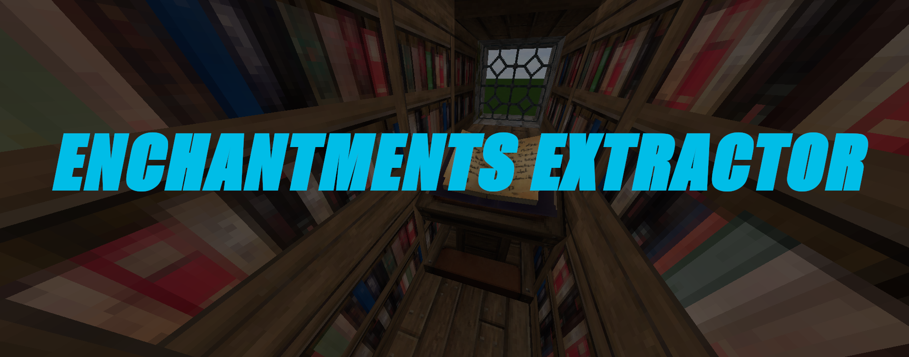

# Enchantment Extractor

Enchantment Extractor is, as its name says, a plugin for extracting enchantment from items.
Swords, Axes, Shovels, Armor... Almost everything that is enchanted can have its enchantments extracted!
## Installation
The instalation couldn't be simpler! Only drag and drop the .jar file to your server /plugins folder.
## Usage
Take the item you want to extract enchantments from, use the command **/disenchant** and make sure to have
diamonds in your inventory, because you will need them to pay the operation!
### How does the extraction work?
The extraction requires diamonds to work, so the plugin calculates how much an extraction costs assuming 
every level of the enchantment cost 1 diamond. So extract Power II from a sword would cost 2 diamonds, Power IV would cost 4 diamonds and so on...

Since **1.2** now you can add custom materials to pay with and you can customize how much do you want your users to pay
for the extracion.
## Permissions
- enchantmentsextractor.disenchant: Allows the user to use the /disenchant command
## TODO:

- ~~Custom materials payment (Not only diamonds ;))~~ Implemented in 1.2
- ~~Custom price for the extractions~~ Implemented in 1.2
- ~~Vault integration (For using money instead of materials)~~ Implemented in 1.1 :)
- ~~Add support for non vanilla enchantment plugins (Referred in [#2](https://github.com/alex55132/EnchantmentsExtractor/issues/2))~~ Implemented in 1.3
- ~~Custom messages~~ Implemented in 1.4
- ~~Multi-language support~~ Implemented in 1.4
-  Failsafe for when trying to extract non-vanilla enchants (Referred in [#4](https://github.com/alex55132/EnchantmentsExtractor/issues/4))
- Ingame prices editor

## Previous versions support

Since this is a very simple plugin, I want to code it for as much versions as requested. Obviously, this is very
hard in practise, so this list will be about the supported minecraft versions the plugin can work with:

Legend:
 - Supported: ✅ 
 - Not supported/No tested: ❌ 
 - In development: 🕐 
 
Minecraft server versions:
 - 1.16: ✅
 - 1.15: ✅ 
 - 1.14: ❌
 - 1.13: ❌
 - 1.12: ❌
 - 1.11: ❌
 - 1.10: ❌
 - 1.9: ❌
 - 1.8: ✅ 
 - 1.7: ❌
 
**Note**: If you want to get the plugin ported to a version feel free to contact me in the plugin spigot page
## Support:

Having trouble with the plugin? Found a bug? Have a suggestion? Feel free to open an Issue on this repository so I can add new things to the plugin :)

## Development:
Do you want to extend the plugin functionality? Great! In this section I'll explain how to do it in order to make all the dependencies
work, so let's begin!

The [VaultAPI](https://github.com/MilkBowl/VaultAPI) is used in order to enable the Economy usage. 

VaultAPI and Spigot API is available through Maven (See pom.xml).

## Language adition:
In order to add a new language to the list just add the messages to the config.yml file and open a pull request indicating the language and its abbreviation